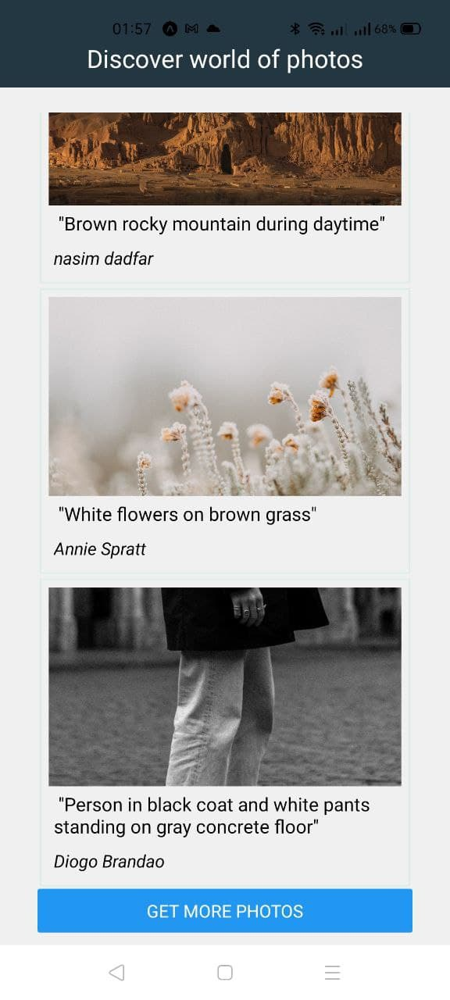

# Unsplash_Photos_react_native

Project was build in React Native framework with using Expo framework

In this app you can see random photos from Unsplash gallery, then you can press the photo to enlarge it to full screen. After that you can go back to viewing other photos

You can see what it looks like in the screenshots

https://github.com/github/{Unsplash_Photos_react_native}/blob/assets/start.jpg 

